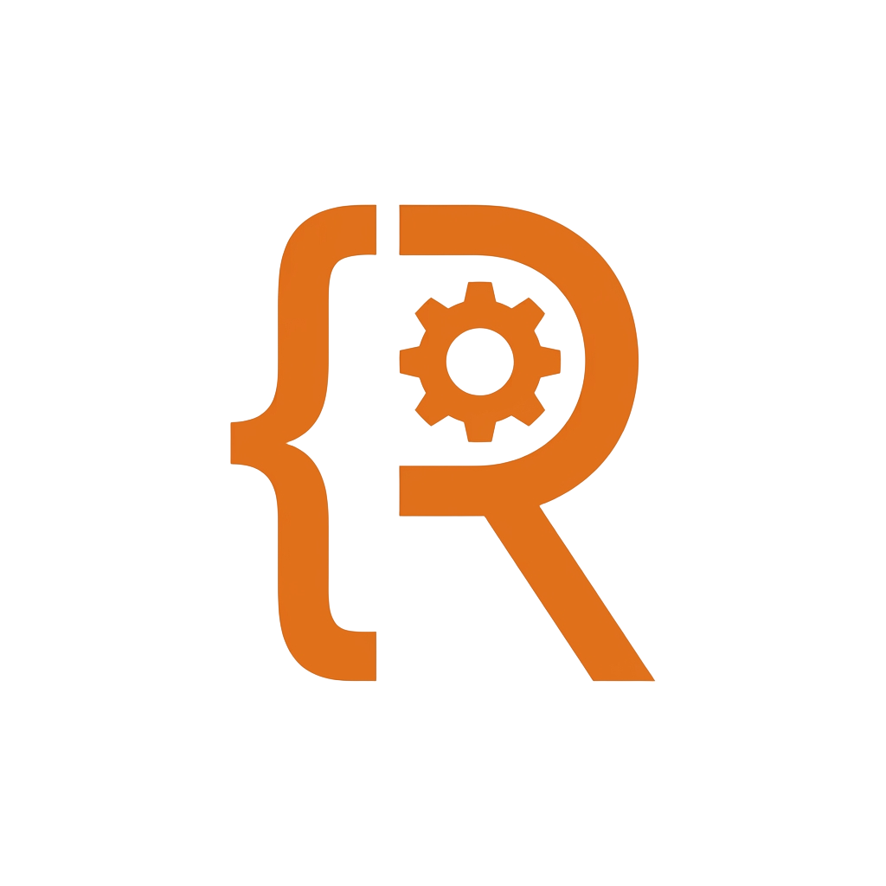

<div align="center">
  
</div>

# Rookie API

Rookie API is an AI-driven platform designed to evaluate and validate the quality of technical documentation. By treating Large Language Models (LLMs) as "Virtual Developers," the system tests whether your API documentation is clear, accurate, and complete enough for an automated agent to understand and interact with your services.

The primary goal is not just to automate tests, but to use AI as a litmus test for documentation: if a "Senior Virtual Engineer" can't write a working test based on your docs, your documentation needs improvement.

## Key Features

- **Documentation Quality Testing**: Uses LLMs as surrogate developers to verify if documentation is sufficient for real-world integration.
- **AI-Native Test Generation**: Test scenarios are dynamically planned and coded by LLMs by reading your provided API specifications.
- **Isolated Execution**: All AI-generated code is executed within secure, ephemeral Docker containers, ensuring no side effects on the host system.
- **RAG-based Diagnosis**: If a test fails because of a documentation gap, the system uses Retrieval-Augmented Generation (RAG) to identify the missing or confusing information.
- **Local Embeddings**: Uses `@xenova/transformers` for local embedding generation, keeping your sensitive documentation on-premise.

## Tech Stack

- **Runtime**: [Deno](https://deno.land/)
- **Web Framework**: [Hono](https://hono.dev/) (with `zod-openapi`)
- **Databases**:
  - **MongoDB**: Stores project metadata, file definitions, test suites, and execution reports.
  - **Qdrant**: Vector database for storing documentation embeddings used in RAG.
- **AI/ML**:
  - **OpenAI (GPT-4/o1)**: For planning test steps and generating JavaScript execution code.
  - **Xenova Transformers**: For local text embedding generation.
- **Isolation**: **Docker** for running untrusted, AI-generated test scripts.

## Getting Started

### Prerequisites

- [Deno](https://deno.land/) (latest version)
- [Docker](https://www.docker.com/)
- [MongoDB](https://www.mongodb.com/)
- [Qdrant](https://qdrant.tech/)

### Infrastructure Setup

Before running the application, ensure you have a Docker network named `rookie-network`:

```bash
docker network create rookie-network
```

Ensure your MongoDB and Qdrant instances are accessible.

### Configuration

The application can be configured via environment variables or a configuration file.

| Variable                       | Description               | Default                     |
| ------------------------------ | ------------------------- | --------------------------- |
| `ROOKIE_HOST`                  | Server host               | `localhost`                 |
| `ROOKIE_PORT`                  | Server port               | `3000`                      |
| `ROOKIE_MONGO_DB_URL`          | MongoDB connection string | `mongodb://localhost:27017` |
| `ROOKIE_MONGO_DB_NAME`         | MongoDB database name     | `rookie_db`                 |
| `ROOKIE_QDRANT_HOST`           | Qdrant host               | `127.0.0.1`                 |
| `ROOKIE_QDRANT_PORT`           | Qdrant port               | `6333`                      |
| `ROOKIE_OPEAN_AI_KEY`          | OpenAI API Key            | (Required for AI features)  |
| `ROOKIE_EMBEDDING_MODEL`       | Model for embeddings      | `Xenova/all-MiniLM-L6-v2`   |
| `ROOKIE_EMBEDDING_VECTOR_SIZE` | Vector size for the model | `384`                       |

### Running the App (Backend)

```bash
# Start the production server
deno task start

# Start in development mode with hot-reload and pretty logging
deno task watch
```

### Running the Frontend (Agentic RAG Monitor)

The project includes a modern React frontend Built with Vite to monitor the LLM execution in real-time.

```bash
cd frontend
npm install
npm run dev
```

The frontend will be available at `http://localhost:5173`. You can enter a Test Suite ID and watch the Agentic RAG execute with token-by-token streaming.

## Workflow

1. **Upload Documentation**: Upload API specifications or text descriptions to a project.
2. **Indexing**: The system processes files, generates embeddings, and stores them in Qdrant.
3. **Define Test Suite**: Specify the testing goals and initial context (e.g., auth tokens).
4. **Execution**:
   - LLM analyzes the documentation and plans a sequence of API calls.
   - Each step is converted into JavaScript code.
   - Code runs in a Docker container; state (`ctx`) is passed between steps.
5. **Reporting**: Review detailed execution logs and results.

## API Documentation

Once the server is running, you can access the interactive API documentation at:
`http://localhost:3000/reference` (Scalar) or `http://localhost:3000/ui` (Swagger UI).
